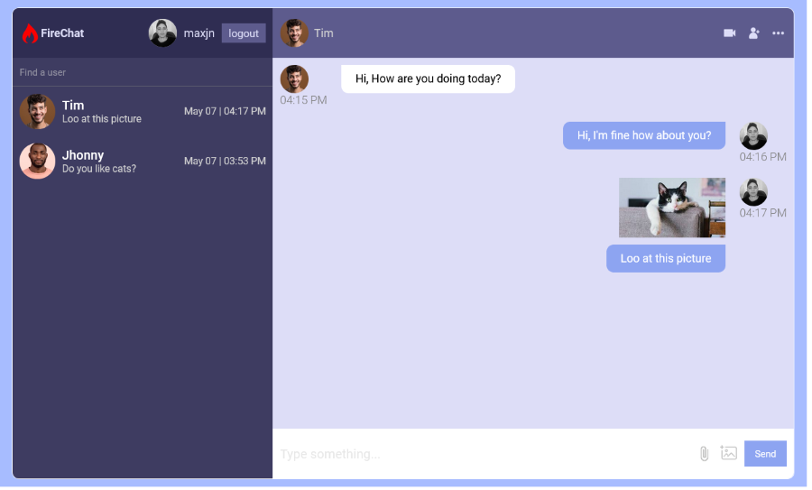

# Firechat - React Firebase Practice

This is a simple chat application for practicing React & Firebase.

See [Live Project](https://maxjn-firechat.pages.dev/).

This Project was bootstrapped with [Vite](https://vitejs.dev/).

## Technologies

- JSX,Tailwind
- ES6
- React
- **react-router-dom** for routing
- **Firestore** for backend

## Features

- Signing Up
- Loging in
- Searching Users
- Chatting

## Installation

Install **Firechat** with npm

```shell
npm install

npm run dev
```

## Screenshots


